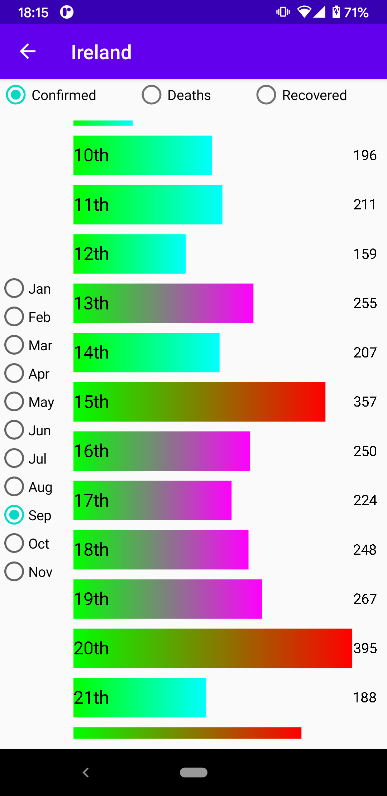

# Covid19CasesLookup
App to look up Covid cases from https://covid19api.com/

Uses:
- Jetpack Compose (integration into exististing UI)
- BDD style UI tests
- Unit tests
- MVVM architecture
- StateFlow
- SharedFlow
- Hilt for dependency injection
- View Binding

For the last stable version checkout master branch

